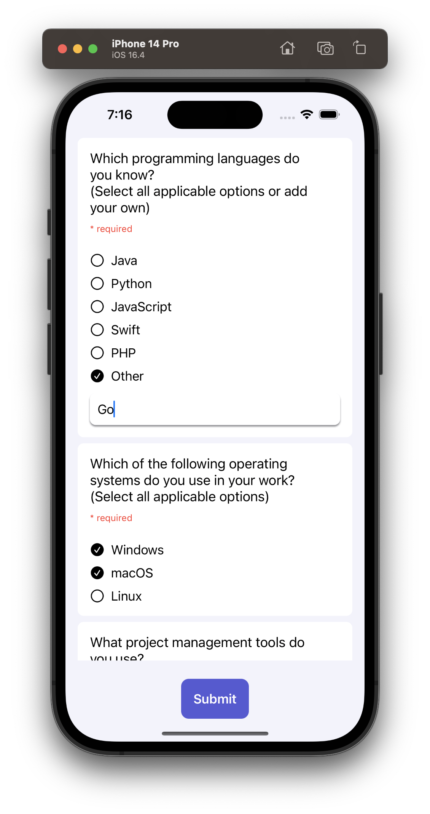

# GoTech Project

GoTech is a project developed for sending and receiving surveys from a server. The application is capable of making requests and loading a JSON file that contains a list of questions. These questions are then passed to a model, which processes and provides the UI with data for answering the questions.

To run the project, you need to use the `db.json` file provided, which contains test data for display. The server can be launched using the following command:

```
npx json-server --watch db.json
```

Once the server is up and running, you can launch the application. The answers that pass the client-side validation will be saved to the `db.json` file.

The project is developed using native methods, follows the MVVM architecture, and does not rely on any third-party libraries. This ensures the security and reliability of the product.




## Project Structure

The project has the following structure:

- Project
  - Models
    - Survey.swift
    - Question.swift
    - Answer.swift
  
  - Views
    - SurveyView.swift
    - QuestionView.swift
  
  - ViewModels
    - SurveyViewModel.swift
    - QuestionViewModel.swift
  
  - Services
    - APIService.swift
  
  - Extensions
    - StringExtensions.swift

The project follows a modular structure, separating the models, views, view models, services, and extensions into their respective directories. This organization promotes code organization and maintainability.

Feel free to explore the project's files to gain a better understanding of its implementation details.